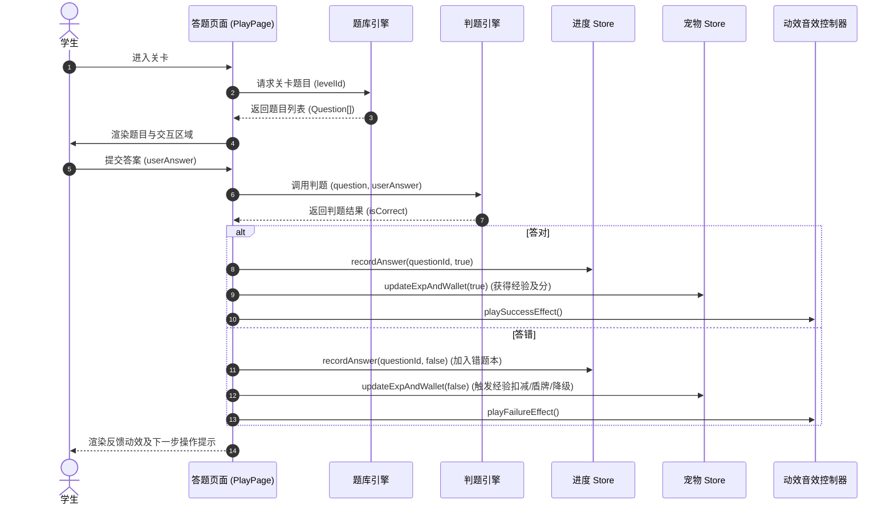
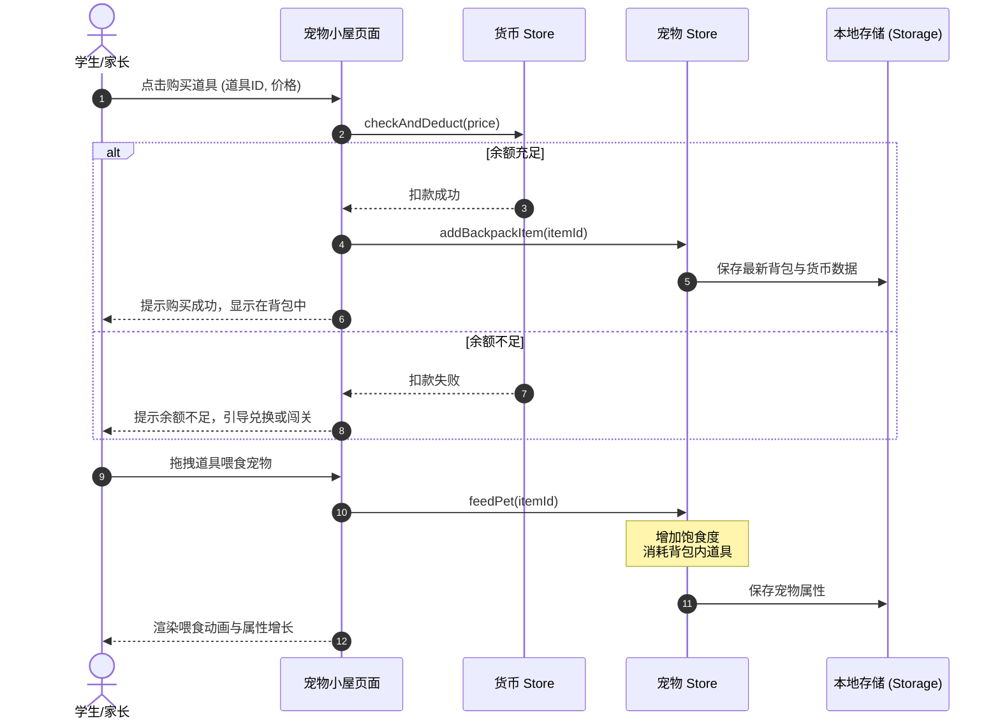

# 小学趣味数学概要设计文档

## 1. 系统总体架构

本项目基于 Vue 3 + Vite + TypeScript + Pinia 构建，采用纯前端单机架构，所有数据存储在本地浏览器中。

### 1.1 系统架构图

```mermaid
graph TD
    subgraph UI 视图层
        Pages[页面组件 Pages]
        Components[公共组件 UI Components]
    end

    subgraph 路由与控制层
        Router[路由模块 Vue Router]
        AudioVisual[音效与动效控制器 Audio/Visual Controller]
    end

    subgraph 状态与核心逻辑层 (Pinia Stores)
        ProgressStore[进度 Store]
        PetStore[宠物 Store]
        WalletStore[货币 Store]
    end

    subgraph 游戏引擎与服务层
        QuestionEngine[题库筛选引擎]
        JudgeEngine[判题引擎]
        CanvasEngine[练写画布引擎]
    end

    subgraph 数据持久化层
        StorageWrapper[本地存储封装 LocalStorage/IndexedDB]
        StaticDB[静态题库 JSON 数据]
    end

    %% 依赖关系
    Pages --> Router
    Pages --> Components
    Pages --> ProgressStore
    Pages --> PetStore
    Pages --> WalletStore
    
    ProgressStore --> QuestionEngine
    ProgressStore --> StorageWrapper
    PetStore --> StorageWrapper
    WalletStore --> StorageWrapper
    
    Pages --> JudgeEngine
    Pages --> CanvasEngine
    
    QuestionEngine --> StaticDB
    ProgressStore -.-> PetStore
    ProgressStore -.-> WalletStore
```

### 1.2 分层职责说明

| 分层 | 模块名称 | 职责描述 |
| :--- | :--- | :--- |
| **UI 视图层** | 页面组件 (Pages) | 包含首页、地图、关卡详情、闯关答题、练写、错题、家长、设置、宠物小屋、兑换游戏等页面。 |
| | 公共组件 (Components) | 封装按钮、进度条、弹窗、星级、各题型渲染器等复用组件。 |
| **路由与控制** | 路由模块 (Router) | 管理页面路由寻址（`/`、`/map`、`/play/:id`、`/pet` 等），实现页面转场控制。 |
| | 音效动效控制器 | 统一管理答题反馈音效、奖励动效、宠物动作与进化音效的触发与静音设置。 |
| **状态与逻辑** | 进度 Store (Pinia) | 维护已通关卡、星级、徽章、答题统计及错题本状态，响应答题结果更新。 |
| | 宠物 Store (Pinia) | 维护宠物等级、经验、属性值、背包等状态，实现双轨成长与等级降级逻辑。 |
| | 货币 Store (Pinia) | 维护用户元、角、分资产，处理购买逻辑及货币兑换的核心进率计算。 |
| **引擎与服务** | 题库筛选引擎 | 根据当前关卡 ID 及配置，从静态题库中筛选并加载题目。 |
| | 判题引擎 | 根据不同题型（选择、填空、拖拽、练写等）的核心校验算法判定用户答案。 |
| | 练写画布引擎 | 负责 `Canvas` 画笔轨迹绘制、撤销、清空、轨迹数据生成及本地保存。 |
| **数据持久化** | 本地存储封装 | 封装对 `localStorage` 或 `IndexedDB` 的异步读写接口，保证数据原子写入。 |
| | 静态题库 (Static DB) | 以静态 JSON 文件组织题库数据，按模块懒加载。 |

---

## 2. 模块划分与接口设计

### 2.1 题库与判题模块 (Question & Judge Engine)

#### 2.1.1 核心数据结构

##### 题库数据结构 ([Question](file:///Users/xudeping/Documents/MyProjects/小学趣味数学/doc/high-level-design.md#L100))
```ts
export type QuestionType = 'choice' | 'fill' | 'drag' | 'match' | 'diagram' | 'write';
export type DifficultyLevel = 'basic' | 'medium' | 'hard';

export interface Question {
  id: string;               // 题目唯一ID
  grade: '1';               // 年级
  semester: 'up' | 'down';  // 学期
  moduleId: string;         // 知识模块ID
  levelId: string;          // 关卡ID
  type: QuestionType;       // 题型
  difficulty: DifficultyLevel; // 难度
  stem: string;             // 题干文字（带拼音标注格式）
  assets: {
    images?: string[];      // 图片资源路径
    options?: string[];     // 选择题/拖拽题的选项
    targets?: string[];     // 拖拽目的地区域/连线目标
  };
  answer: unknown;          // 标准答案（选择题为索引/文本，填空为文本，拖拽/连线为映射关系）
  explanation: string;      // 提示或解析
  tags: string[];           // 知识点标签
}
```

#### 2.1.2 判题引擎接口

##### 判题函数 ([judgeAnswer](file:///Users/xudeping/Documents/MyProjects/小学趣味数学/doc/high-level-design.md#L125))
```ts
export function judgeAnswer(question: Question, userAnswer: unknown): boolean {
  switch (question.type) {
    case 'choice':
      return String(question.answer) === String(userAnswer);
    case 'fill':
      return String(question.answer).trim() === String(userAnswer).trim();
    case 'drag':
      return JSON.stringify(question.answer) === JSON.stringify(userAnswer);
    case 'write':
      // MVP 阶段仅记录书写轨迹，默认返回 true
      return true;
    default:
      return false;
  }
}
```

### 2.2 存储与进度模块 (Store & Progress Service)

#### 2.2.1 进度数据结构 ([LearningProgress](file:///Users/xudeping/Documents/MyProjects/小学趣味数学/doc/high-level-design.md#L145))
```ts
export interface ModuleStat {
  moduleId: string;
  totalAnswered: number;
  totalCorrect: number;
  accuracy: number;
}

export interface LearningProgress {
  completedLevelIds: string[];            // 已通关卡ID列表
  starsByLevel: Record<string, number>;    // 关卡ID -> 星星数量(1-3)
  badges: string[];                        // 已获得徽章列表
  moduleStats: Record<string, ModuleStat>; // 模块ID -> 模块掌握情况统计
  totalAnswered: number;                   // 累计答题总数
  totalCorrect: number;                    // 累计答对总数
  studyDays: string[];                     // 学习打卡日期 (YYYY-MM-DD)
  updatedAt: string;                       // 最后更新时间戳
}
```

#### 2.2.2 错题数据结构 ([MistakeRecord](file:///Users/xudeping/Documents/MyProjects/小学趣味数学/doc/high-level-design.md#L165))
```ts
export interface MistakeRecord {
  questionId: string;      // 题目ID
  moduleId: string;        // 模块ID
  levelId: string;         // 关卡ID
  wrongAnswer: unknown;    // 错误答案
  correctAnswer: unknown;  // 正确答案
  mistakeCount: number;    // 错误次数
  masteredCount: number;   // 连续答对以标记掌握的次数
  lastWrongAt: string;     // 最近一次答错时间
}
```

### 2.3 宠物与成长模块 (Pet & Leveling System)

#### 2.3.1 宠物数据结构 ([PetData](file:///Users/xudeping/Documents/MyProjects/小学趣味数学/doc/high-level-design.md#L180))
```ts
export interface PetData {
  chosenPet: 'cat' | 'dog' | null;  // 选中的宠物类型
  name: string;                     // 宠物昵称
  level: number;                    // 宠物等级 (因答错扣减可能降级)
  exp: number;                      // 当前等级的经验值
  satiety: number;                  // 饱食度 (0-100)
  cleanliness: number;              // 清洁度 (0-100)
  shieldCount: number;              // 每日剩余免错盾牌次数
  wallet: {
    yuan: number;                   // 元
    jiao: number;                   // 角
    fen: number;                    // 分
  };
  backpack: Record<string, number>; // 道具背包, 格式为: { 道具ID: 数量 }
  lastUpdateTime: string;           // 上次更新时间，用于离线消耗计算
}
```

#### 2.3.2 宠物成长与等级逻辑

##### 等级经验上限算法 ([getUpgradeExp](file:///Users/xudeping/Documents/MyProjects/小学趣味数学/doc/high-level-design.md#L200))
```ts
export function getUpgradeExp(level: number): number {
  // 每级所需经验公式：level * 100
  return level * 100;
}
```

##### 状态与等级变更计算 ([applyAnswerResult](file:///Users/xudeping/Documents/MyProjects/小学趣味数学/doc/high-level-design.md#L210))
```ts
export interface ExpUpdateResult {
  levelChanged: 'up' | 'down' | 'none';
  newLevel: number;
  newExp: number;
  shieldTriggered: boolean;
}

export function applyAnswerResult(
  pet: PetData,
  isCorrect: boolean
): ExpUpdateResult {
  let level = pet.level;
  let exp = pet.exp;
  let shieldTriggered = false;

  if (isCorrect) {
    exp += 20; // 答对增加20经验
    const nextLimit = getUpgradeExp(level);
    if (exp >= nextLimit) {
      exp -= nextLimit;
      level += 1;
      return { levelChanged: 'up', newLevel: level, newExp: exp, shieldTriggered };
    }
  } else {
    // 答错处理
    if (pet.shieldCount > 0) {
      // 触发免错盾牌保护
      pet.shieldCount -= 1;
      shieldTriggered = true;
    } else {
      exp -= 10; // 答错扣除10经验
      if (exp < 0) {
        if (level > 1) {
          level -= 1;
          exp = getUpgradeExp(level) - 10; // 降级并继承余下经验
          return { levelChanged: 'down', newLevel: level, newExp: exp, shieldTriggered };
        } else {
          exp = 0; // 1级时经验不低于0
        }
      }
    }
  }
  return { levelChanged: 'none', newLevel: level, newExp: exp, shieldTriggered };
}
```

### 2.4 练写模块 (Writing Canvas)

#### 2.4.1 数据结构 ([WritingRecord](file:///Users/xudeping/Documents/MyProjects/小学趣味数学/doc/high-level-design.md#L260))
```ts
export interface StrokePoint {
  x: number;
  y: number;
  timestamp: number;
}

export interface WritingRecord {
  id: string;               // 练写记录ID
  targetText: string;       // 练写的目标内容
  strokes: StrokePoint[][]; // 二维数组，存储笔画及其坐标点轨迹
  createdAt: string;        // 练写时间
}
```

### 2.5 兑换游戏模块 (Exchange Game Engine)

#### 2.5.1 货币兑换计算 ([convertCurrency](file:///Users/xudeping/Documents/MyProjects/小学趣味数学/doc/high-level-design.md#L280))
```ts
export interface Wallet {
  yuan: number;
  jiao: number;
  fen: number;
}

export function convertCurrency(wallet: Wallet): Wallet {
  let totalFen = wallet.yuan * 100 + wallet.jiao * 10 + wallet.fen;
  
  const yuan = Math.floor(totalFen / 100);
  totalFen %= 100;
  
  const jiao = Math.floor(totalFen / 10);
  const fen = totalFen % 10;

  return { yuan, jiao, fen };
}
```

---

## 3. 模块关系与数据流设计

### 3.1 答题流程数据流



### 3.2 人民币商店与喂食数据流



---

## 4. 关键设计考量

### 4.1 双轨进化与降级保护机制
- **章节进化**：宠物的外形进化级别直接绑定 `ProgressStore.completedLevelIds`。通关特定里程碑关卡时，触发进化动画。该状态只增不减。
- **等级升降**：宠物的数值等级与经验值实时计算。降级时，直接将经验值设为降级后等级的最大值减去扣减经验（-10）。
- **盾牌机制**：每天首次登录重置 `shieldCount`，抵消答错惩罚。

### 4.2 纯前端数据持久化安全性与鲁棒性
- **写时复制与验证**：在写入 `localStorage` 之前，必须对数据对象进行 JSON 校验和属性存在性检查，防止部分写入导致数据损坏。
- **数据版本兼容**：设置 `DATA_VERSION` 常量，每次加载本地数据时比对版本号，执行对应的数据迁移转换逻辑，保证未来扩展字段时的向后兼容性。
